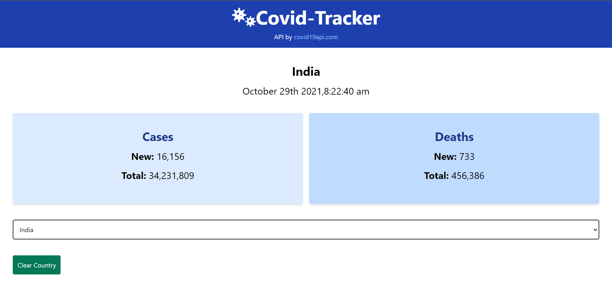

# covid-tracker site


## [Hosted](https://covid19cases-tracker.netlify.app/)

### Home Page



## Project setup

```
npm install
```

### Compiles and hot-reloads for development

```
npm run serve
```

### Compiles and minifies for production

```
npm run build
```

### Customize configuration

See [Configuration Reference](https://cli.vuejs.org/config/).
